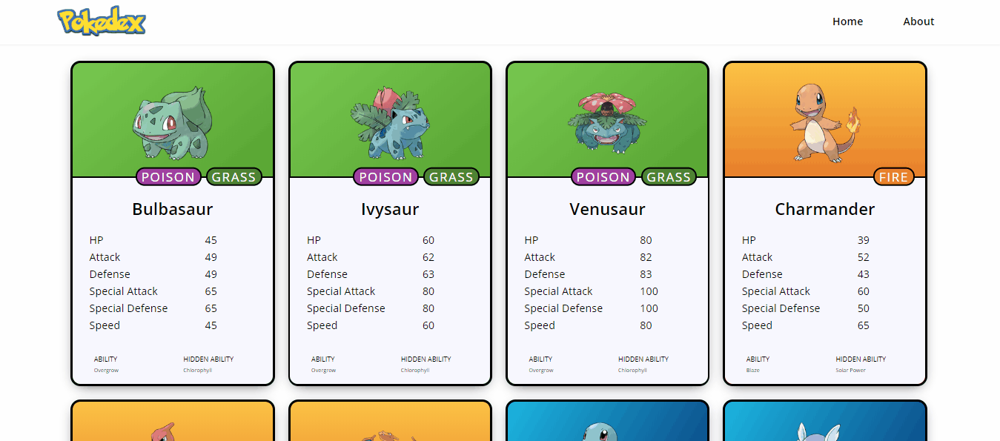

# Pokédex

A personal project created in React JS.

  - Infinity Scroll.
  - Responsive.
  - Using the [pokemon API](https://pokeapi.co/).

# [Live demo](https://pokedexjs.bryanrogel.vercel.app/).



### Tech

* [React JS](https://es.reactjs.org/)
* [Styled Components](https://styled-components.com/)
* [Axios](https://github.com/axios/axios)
* [Redux](https://react-redux.js.org/)
* [Apexcharts](https://apexcharts.com/)

### Installation

This pokédex requires [Node.js](https://nodejs.org/) to run.

Install the dependencies and start the server.

```sh
$ npm i
$ npm start
```

### Disclaimer

This is not a licensed by Nintendo(R) or The Pokémon Company(R),  I am not affiliated with or sponsored by Nintendo(R) or The Pokémon Company(R).

The images of the pokémon and other related indicia, as well as the Pokémon themselves, are copyright of Nintendo(R) and The Pokémon Company(R).

License
----

none


